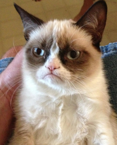
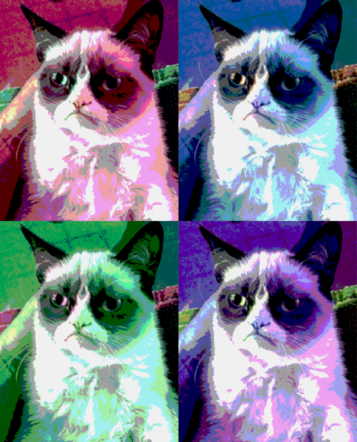

:nofooter:
:icons: font

== Pop-Art Image Generator

Write a program that generates a 2-by-2 "pop-art" image from a single
original image as shown below:

.Input Image (link:data/grumpy.ppm["Grumpy Cat" sample image])

.Output Image

The program shall provide the following command-line interface

----
$ popgen INPUT_FILE OUTPUT_FILE RGB_STRING
----

* `INPUT_FILE` is the original PPM filename
* `OUTPUT_FILE` is the generated PPM filename
* `RGB_STRING` is a string that contains four groups of the letters `r`, `g`, and `b`. +
   It determines in which order color channels are written to the output sub-image.
   The groups shall be separeted by colons (`':'`). The groups do not have to be
   permutations of `rgb` necessarily. E.g., `rrb` shall also be possible.

=== Implementation

. Read the original PPM image into memory & determine its dimensions
. Allocate memory for an image that is twice as high and twice as wide
. Generate the four sub-images in some nested `for` loops
+
[TIP]
======
You may apply some bit-masking to the color channels to achieve the
"threshold" look as in the example above. E.g., you could use

----
color_channel = (color_channel & 0xC0 ) | ((color_channel&0xC0) >> 2)
----

Experiment with some masks yourself!
======

. Write the content of the allocated memory to the output PPM file (of course
  with a PPM header prepended).

=== Example Execution

Used to obtain the sample image above:

----
$ popgen grumpy.ppm grumpyart.ppm grb:rbg:bgr:brg
----
